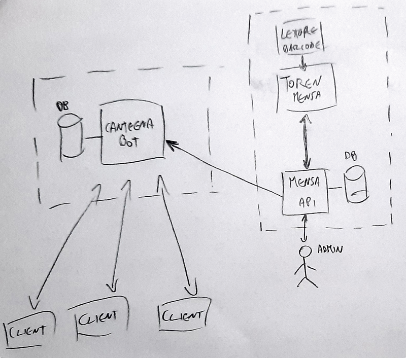

# canteena : mensa 2.0

## Introduzione
Durante l'anno scolastico 2020/2021, in piena emergenza COVID-19, è stato necessario modificare e razionalizzare l'accesso alla mensa scolastica da parte degli studenti, al fine di garantire il necessario distanziamento sociale tra gli studenti e tra il personale della mensa stesso..

Pertanto il flusso degli studenti, in ingresso alla mensa scolastica, è stato regolato manualmente dal personale scolastico. Ciò ha permesso il corretto controllo del flusso degli studenti; tuttavia ha richiesto l'impiego di personale scolastico che è quindi stato distratto da altre attività pianificate.
 
Per tale motivo per l'anno scolastico **2021/2021** si vuole dotare la scuola di un sistema di gestione dell'accesso alla mensa dell'istituto E. Agnelli, in modo da garantire il distanziamento sociale, razionalizzare gli accessi, ridurre le code e impiegare meno personale a supporto delle operazioni.

## Requisiti del sistema

I requisiti iniziali del sistema in oggetto sono i seguenti:

| ID  | Descrizione Requisito                                                                                                           | Priorità |
| --- | ------------------------------------------------------------------------------------------------------------------------------- | -------- |
| 1   | Gli studenti per accedere alla mensa devono essere preventivamente registrati tramite https://mensa.agnelli.it                  | MUST     |
| 2   | Il sistema deve gestire in modo autonomo l'accesso alla mensa da parte degli studenti registrati                                | MUST     |
| 3   | Gli studenti non registrati non saranno gestiti dal sistema in oggetto                                                          | MUST     |
| 4   | Nell'orario di apertura della mensa, il sistema notifica ogni singolo studente sull'orario previsto di accesso alla mensa       | MUST     |
| 5   | In caso in cui lo studente non si presentasse alla mensa, viene notificato per 3 volte consecutive con intervallo configurabile | MUST     |
| 6   | Il sistema effettua le chiamate gestendo delle priorità amministrative per classe                                               | COULD    |
| 7   | Gli studenti ricevono la notiifca dal sistema tramnite smartphone                                                               | MUST     |
| 8   | Il sistema supporta i dispositivi Android e iOS degli studenti                                                                  | MUST     |
| 9   | Il sistema deve possedere un portale che fornisce la documentazione completa delle operazioni e del funzionamento del sistema   | MUST     |
| 10  | I nuovi componenti del sistema devono essere sviluppati esclusivamente con tecnologie web                                       | MUST     |
| 11  | Il sistema supporta messaggi multi-lingua in funzionew delle preferenze dell'utente                                             | COULD    |
| 12  | Il sistema si interfaccia all'applicazione esistente                                                                            | MUST     |
| 13  | Non sono richieste modifiche al sistema esistente                                                                               | MUST     |
| 14  | Gli utenti per essere notificati devono effettuare una registrazione al servizio canteena                                       | MUST     |

## Documentazione

NPM package per le API, maggiori informazioni su NPM (https://www.npmjs.com/)

- [Telegram bot tutorial con Node.js](https://www.html.it/pag/398730/telegram-bot-in-node-js/)

- [Telegram bot tutorial con Node.js su Linux (Ubuntu)](https://www.cloud.it/tutorial/come-creare-un-bot-per-telegram-con-nodejs-su-ubuntu-18-04.aspx)

- [Funzioni aggiuntive, immagini risposte etc + tutorial base ](https://www.section.io/engineering-education/telegram-bot-in-nodejs/)

- [Repository "Node.js Telegram Bot API"](https://github.com/yagop/node-telegram-bot-api/blob/master/README.md)

- [Alcuni bot esitenti in JavaScript ](https://core.telegram.org/bots/samples#node-js)

- [Informazioni generali sui Bot di Telegram](https://core.telegram.org/)

## Architettura

In figura l'architettura di alto livello (*HLA*)

L'architettura si compone di tre componenti principali:

1. <u>Il sistema di gestione della mensa [già esistente]</u>: ha il compito di gestire le prenotazioni al servizio mensa da parte degli studenti e di permettere l'accesso al servizio tramite la scansione del codice a barre del badge studenti. 
2. <u>Il sistema canteena [nuovo sistema]</u>: ha il compito di interfacciarsi al sistema di gestione esistente e di notificare gli utenti, del servizio mensa, confermando la possibilità di accedere al servizio mensa a partire da uno specifico momento.
3. <u>I client utente</u>: sono gli utilizzatori del servizio, che attraverso una notifica push sul proprio smartphone personale, verranno notificati della disponibilità del servizio mensa. 

### Funzionamento

Come da policy scolastica, l'utente del servizio mensa deve autenticarsi al portale  https://mensa.agnelli.it/mensa/  e prenotare il pasto per il giorno successivo.

Durante la mattinata, la segreteria valida e conferma tutte le prenotazioni, gestendo eventuali cancellazioni o aggiunte. Al termine della validazione la lista degli utenti che usufruiscono del servizio mensa, per il giorno corrente, è definitiva.

A questo punto, il bot Canteena, interroga il servizio API della mensa, per ottenere la lista definitiva degli utenti del giorno. 
Ora il bot, a partire dalle 13.50 è in grado di notificare al primo lotto di utenti la disponibilità del servizio, invitando gli utenti notificati a recarsi presso il corridoio d'ingresso al servizio mensa.

Quando un utente fornisce il badge al personale addetto, questo viene letto con un lettore di codici a barre. Quest'informazione viene inviata dal token, presente in sala mensa, al server di gestione della mensa.

Periodicamente il bot canteena, interroga il server della mensa (modalità pull) per ottenere la lista degli utenti che hanno già usufruito del servizio (in questo sistema una volta che il badge è scansionato si assume che l'utente sia stato servito ed uscito dalla coda di servizio).
Il bot in questo modo conosce sia il numero di utenti notificati, sia il numero di utenti serviti, perciò può implementare una gestione efficace della coda e delle notifiche agli utenti.

In linea di principio, non appena un utente viene servito, il bot può notificare l'utente successivo in lista d'attesa.
Il bot è in grado di rinotificare un utente che non si è presentato al servizio mensa. Il numero delle notifiche è finito e per default stabilito a 3.
Si lascia all'implementazione la gestione del batch delle notifiche, che può seguire policy specifiche adattabili per diversi periodi dell'anno o diversi anni scolastici.

Questa gestione per quanto semplicistica permette di soddisfare i requisiti di progetto e raggiungere l'obiettivo finale nel ridurre l'assembramento degli utenti e fornire una qualità del servizio migliore (ridotti tempi di attesa per essere serviti).

|ID | Priorità | Soddisfatto | Descrizione|
|--|---|--|--|
| 1  |  MUST     | Y | Soddisfatto dal sottosistema di gestione delle prenotazioni |
| 2   |  MUST     | Y | Come desscritto sopra, l'utente viene notificato in maniera automatica dal nuovo bot|
| 3   | MUST     | Y | Se l'utente non è registrato presso il server della mensa, e quindi non presente nella lista confermata dalla segreteria, non verrà certamente notificato dal nuovo bot|
| 4   | MUST     | Y | Come descritto, la notifica viene inviata dal nuovo bot canteena e pertanto viene garantito che ogni singolo studente sarà notificato in merito all'orario di accesso alla mensa|
| 5   | MUST     | Y | Come descritto il bot notifica gli utenti che non si sono presentati al token per un massimo di 3 volte.|
| 6   | COULD     | N | Il bot notifica gli studenti in ordine alfabetico|
| 7   | MUST     | Y | Gli studenti ricevono le notifiche tramite l'app Telegram sul proprio smartphone|
| 8   | MUST     | Y | Telegram è disponibile per le maggiori piattaforme, incluse Android e iOS|
| 9   | MUST     | Y | Il portale del servizio mensa include un link alla documentazione e guida utente per il sistema di notifica|
| 10  |MUST     | Y | Il sistema canteena è sviluppato in javascript |
| 11  | COULD     | N | La prima release del sistema invia notifiche in lingua italiana|
| 12  | MUST     | Y | Il bot canteena si interfaccia via API HTTP al serve pre-esistente della mensa|
| 13  | MUST     | Y | Il sistema esistente non richiede nessuna modifica rispetto alla versione corrente|
| 14  | MUST     | Y | L'utente deve inviare una sola volta un comando di registrazione al bot canteena|

## Progetto di dettaglio
