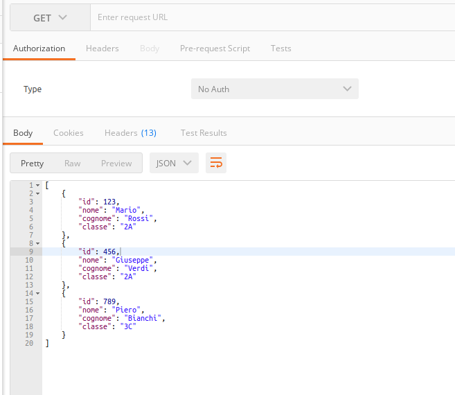
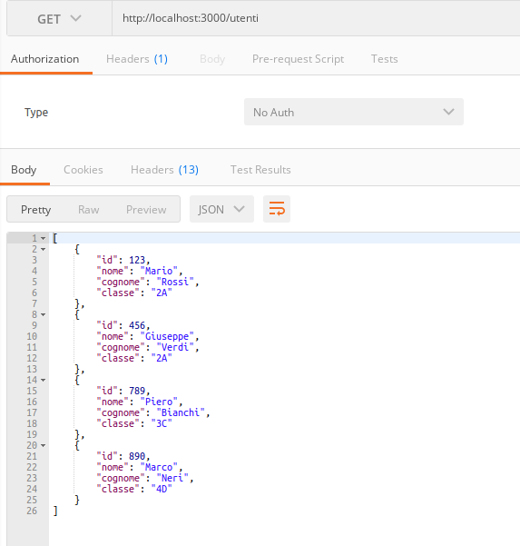

# API server mockup

Spesso nello sviluppo di un'applicazione è necessario utilizzare uno o più servizi che espongono un API [REST](https://it.wikipedia.org/wiki/Representational_State_Transfer).

Come sviluppatore front-end non ho interesse a sviluppare un server REST solido e scalabile, ma ho la necessità solo di poter accedere a dei dati di test e poter testare il mio client.

Per fare ciò in modo veloce ci viene in auto un package json molto utile, chiamato [**json-server**](https://www.npmjs.com/package/json-server).

Lo scopo di **json-server** è permettere la creazione di un server REST completo in pochi secondi e senza scrivere nessuna linea di codice.

## Installare json-server

json-server va installato come modulo globale, pertanto è necessario passare il flaf `-g` al classico comando npm

```
sudo npm -g install json-server
```

NOTA: *siccome installiamo un modulo a livello globale, dobbiamo farlo come root, pertanto usiamo sudo*


## Data mockup

Ora che json-server è installato, dobbiamo creare un piccolo e semplice database.
Per fare ciò creaimo un file chiamato *utenti.json*.

```
{
    "utenti": [
        {
            "id": 123,
            "nome": "Mario",
            "cognome": "Rossi",
            "classe": "2A"
        },
        {
            "id": 456,
            "nome": "Giuseppe",
            "cognome": "Verdi",
            "classe": "2A"
        },
        {
            "id": 789,
            "nome": "Piero",
            "cognome": "Bianchi",
            "classe": "3C"
        }
    ]
}
```

## Run dell'API

Ora che abbiamo il database con dei dati validi, possiamo far partire il json server in modo che renda disponibile i dati del database attraverso una API REST perfettamente funzionante.

Lanciamo il server con:

```
json-server --wathc utenti.json
```

Se sulla console appare qualcosa di simile, siete apposto, il server è operativo:

```
  \{^_^}/ hi!

  Loading utenti.json
  Done

  Resources
  http://localhost:3000/utenti

  Home
  http://localhost:3000

  Type s + enter at any time to create a snapshot of the database
  Watching...

```

## POSTMAN

Per poter interagire con il server REST, abbiamo bisogno di un REST client.
Lo strumento principe via console è curl e il più moderno [**httpi**](https://httpie.io/)

In modo analogo il re dei tool GUI è [**postman**](https://www.postman.com/).

Installate [postman per chrome](https://chrome.google.com/webstore/detail/postman/fhbjgbiflinjbdggehcddcbncdddomop?hl=it) e fate il signup.


## Interagiamo con il database tramite l'API REST

Lanciate postman *chrome://apps* da chrome e fate il login se necessario.

### Lista di tutti gli utenti (GET)

Selezionate il metodo GET, ed inserite la seguente URL

```
http://localhost:3000/utenti
```

Ora premete il pulsante Send (Invia), ed una richiesta GET viene inviata al json-server, che a sua volta fornirà la lista di tutti gli utenti.
Se tutto funziona correttamente, otterrai qualcosa di simile:



### GET di uno specifico utente

Ora inviate, tramite postman, la seguente richiesta

```
http://localhost:3000/utenti/456
```

Vedrete in output l'oggetto (record nel linguaggio dei DB relazionali), relativo all'utente con id *456*.

### Aggiungiamo un utente (POST)

Selezionate il metodo **POST** e nel body della richiesta inserite il recoord in formato [**json**](https://it.wikipedia.org/wiki/JavaScript_Object_Notation) per un nuovo utente e premete `Send`

```
{
    "id": 890,
    "nome": "Marco",
    "cognome": "Neri",
    "classe": "4D"
}
```

Se tutto funziona correttamente, otterrai qualcosa di simile:


Se ora eseguite nuovamente la *query* di prima, vederete che la lista degli utenti contiene il nuovo utente  appena aggiunto



NOTA: *il file utentui.json è stato aggiornato ed ovviamente contiene il record appena aggiunto*

### Altri metodi PUT e DELETE

In modo analogo è possibile sperimentare anche con l'update *(PUT)* di un record esistente e la cancellazione *(DELETE)* del record.

